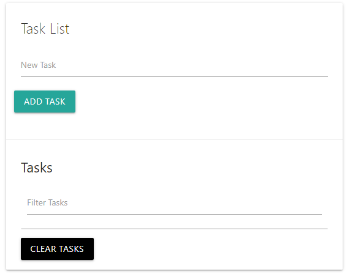

# Task List App
 A task list app that logs, filters and stores user data in system storage for repeat use. 

 

 ## Project Specifications
 - Add tasks
 - List tasks
 - Filter through tasks
 - Persist tasks to local storage so that they can save for later use.

 ## Instructions
 - Click in the text field where it says 'New Task' and type in a task.
 - Click the Add task button to save it to the list
 - Click the 'Clear Tasks' button to remove a task.
 - Reload your page and all of your tasks will still be saved in the browser memory.
 
 
## Steps to execute this Task List:
- Download the entire code 
- Open up the index.html.
- [View Live Site](https://anthonys1760.github.io/Simple-Calculator/)

## Technologies used: 
- HTML
- CSS 
- Javascript